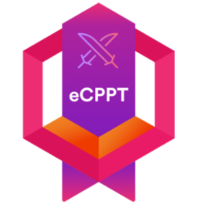
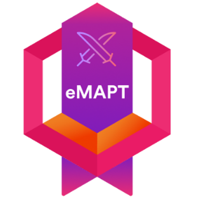

<h2> 😎🤏 Hi,  I am Tek (m4xcrk) ! </h2>

### Glad to see you here! &nbsp; 

As an Offensive Security Engineer and a Technology Enthusiast at large, I spend a lot of time debugging, learning, playing CTFs, and writing my blog posts while working as a professional and trying to get better experience in red teaming, pivoting techniques, AV evasion and analyzing modern malware techniques. I also put my hands on, hardware stuff, including Arduino & Raspberry Pi. I am always looking for a fresh challenge. 💡

<ul>
<li>👨‍🎓 Graduated at University of Allahabad-BCA Specializing in Cyber Security.</li>
<li>🇳🇵 From Nepal </li>
</ul>

You can reach me at 👇

  
##  Trophies

| OSCP                                                                                                                       | C\|PENT                                                                                                                                                              | eCPPT                                                                                                                     | eMAPT                                                                                                                     | ICCA                                                                                                                     | C\|EH (M)                                                                                                                                                           | 
| :------------------------------------------------------------------------------------------------------------------------: | :------------------------------------------------------------------------------------------------------------------------------------------------------------------: | :------------------------------------------------------------------------------------------------------------------------:| :-----------------------------------------------------------------------------------------------------------------------: | :----------------------------------------------------------------------------------------------------------------------: | :-----------------------------------------------------------------------------------------------------------------------------------------------------------------: | 
|    |   |  |  |  |  | 
| | HTB                                                                                                 | C\|EH (P)                                                                                                                                                           | C\|EH                                                                                                                                                             | CRTS                                                                                                                     |
| |  |  |  |  |

---
  
Feel free to give Your Suggestions, Issues or PRs🌍

